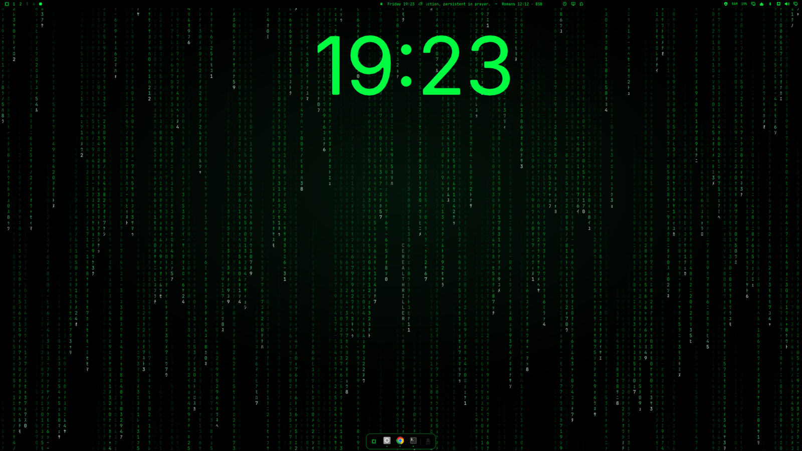

# TheMatrix Theme for Omarchy

Phosphor-green digital rain on void black — a terminal-hacker take on
[the 1999 film](https://en.wikipedia.org/wiki/The_Matrix) for
[Omarchy](https://omarchy.org).



## Installation

```bash
omarchy theme install https://github.com/CerealThriller/omarchy-the-matrix-theme
```

Or from the Omarchy menu (`Super + Space`): _Install > Style > Theme_, then
paste the repository URL.

Once installed, pick "TheMatrix" under _Style > Theme_.

## What's Included

- **Palette** (`colors.toml`) — terminals, Hyprland, the Omarchy shell, btop,
  Neovim, VS Code, and the rest are generated from it.
- **Backgrounds**:
  1. **Digital rain** — the classic falling-code look
  2. **Cityscape** — a green-on-black skyline
  3. **Hallway** — three figures standing in a lit doorway at the end of a
     corridor, built entirely out of code density/brightness rather than a
     photo (no reference pixels are reused, only its composition/luminance)
- **Lock screen**: the password card's colors (text, placeholder, border,
  error state) come from `colors.toml` automatically, same as everything
  else. `unlock.png` is the art shown above that card — a retro CRT terminal
  boot/login prompt, scanlines and phosphor glow included. If you use the
  Lock Screen Explorer plugin, a live animated version is also available —
  see [Live Lock Screen](#live-lock-screen-lock-screen-explorer) below.
- **Icons** (`icons.theme`)

## Fan / Motherboard RGB (OpenRGB)

If you have OpenRGB-compatible hardware (ARGB motherboard headers, Corsair
Lighting Node Pro, etc.), you can sync it to this theme's accent color with a
small hook. Save this as `~/.config/omarchy/hooks/theme-set.d/openrgb-accent`
and make it executable:

```bash
#!/bin/bash
RGB_FILE="$HOME/.local/state/omarchy/current/theme/keyboard.rgb"
if command -v openrgb >/dev/null 2>&1 && [[ -f $RGB_FILE ]]; then
  hex=$(cat "$RGB_FILE")
  hex="${hex#\#}"
  if [[ $hex =~ ^[0-9A-Fa-f]{6}$ ]]; then
    openrgb --noautoconnect --mode static --color "$hex" >/dev/null 2>&1 &
  fi
fi
```

It reads the theme's `keyboard.rgb` (already `00FF00` here) and pushes it to
every OpenRGB-detected device on every theme change. Note: some ARGB LEDs
render pure green (`00FF00`) with a slight cyan cast — that's the hardware,
not the theme.

## Live Lock Screen (Lock Screen Explorer)

If you have the [Lock Screen Explorer](https://github.com/SirJul1337/omarchy-lock-explorer)
plugin installed, `unlock.png` isn't used — instead you can drop in a live,
animated version: real falling code behind a CRT terminal card (boot text,
blinking cursor, your username, password field), all colored from this
theme's palette automatically. The falling-code canvas itself is adapted
from that plugin's own built-in "Rain" design (see Credits).

```bash
mkdir -p ~/.config/omarchy/lock-designs
curl -o ~/.config/omarchy/lock-designs/TheMatrixTerminal.qml \
  https://raw.githubusercontent.com/CerealThriller/omarchy-the-matrix-theme/main/extras/lock-designs/TheMatrixTerminal.qml
omarchy-shell lock rescanDesigns
omarchy-shell lock setDesign my-thematrixterminal
```

## Credits

- **Concept**: a fan homage to [The Matrix](https://en.wikipedia.org/wiki/The_Matrix)
  (1999, Warner Bros.). Not affiliated with or endorsed by Warner Bros.,
  and no claim is made over the film's trademarks, characters, or imagery —
  this theme only reuses a handful of short, iconic lines of dialogue and a
  generic visual style (green falling code on black).
- **Live terminal lock design** (`extras/lock-designs/TheMatrixTerminal.qml`):
  the falling-code canvas is adapted from the "Rain" design built into
  [Lock Screen Explorer](https://github.com/SirJul1337/omarchy-lock-explorer)
  by SirJul1337 (MIT licensed). The CRT terminal card built on top of it is
  original to this theme.
- **Backgrounds and unlock art**: generated with AI assistance (Claude /
  Claude Code) from scratch — no photos, film frames, or other artists'
  images were used as source pixels, only as a compositional/lighting
  reference in one case (credited in that background's own history, not
  reused directly).

## License

The configuration and code in this repo (`colors.toml`, the OpenRGB hook,
this README, and the original parts of the lock design) are MIT licensed —
see [Credits](#credits) above for the one adapted file. Beyond that, no
strong ownership claim is made over the AI-generated images themselves or
over anything evoking The Matrix as a concept; use, remix, and redistribute
this theme freely.
